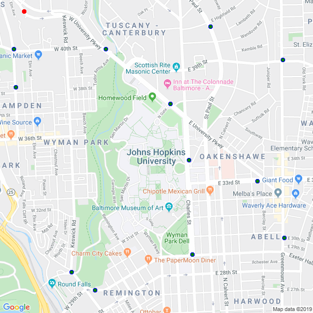

# Welcome to the Multi-Drop-Point-Optimizer (MDPO)


## Who would want to use this?

If you're carpooling with a bunch of friends, you might want to choose the shortest path that connects all the pick-up or drop off destinations so that you dont end up driving in circles or up and down the same street unnecessarily. What's that? You don't have friends because you're busy running an Uber-like company and need to make sure your vehicles drive the optimum route so that you reach the most customers in the least amount of time using the least amount of fuel. Wait what?! Your company didn't work out and you decided to move into the public transportation sector and have been asked to knock off a few bust stops so that the new bus route caters to the busier parts of town. <br>

<font color="red"> If you are any of these people, then you're in luck because our code can help you out! </font>

## How it works?
```markdown
1. The user inputs the location in which all the pick-up/drop-off locations are found. The Google Maps API gets the map of the requested location. Also the user inputs the Zoom level. From Google Maps you get a 256x256 pixels image at 0 zoom level, while for zoom level 1 its a 128x128 pixels image. So the rest of the zoom levels are set in a similar way. 
2. It turns the map into a black and white version of itself.
3. For the code to run well for large maps, we create a mask of 4 pixels which moves through the whole image. The mask averages out the pixels in it. If the average is non-zero then a value of 1 is assigned to a corresponding location in a 2D-array. This array represents our map in a grid form.
4. The user inputs the multiple locations which are the drop-off points they want the path to be optimised around.
5. The grid is then passed into the path-searching grid solver which is based off of the breadth first search algorithm.
6. This BFS Algorithm uses queues to find the shortest and optimum path. Queues work on First In First Out system, unlike stacks they visit all possible points and instead of the last element being popped out here the first one is popped.
7. The code then produces a GIF of the path through all the stops.
```
<bold> In addition </bold>
```markdown
1. The code can calculate the actual distance travelled based on the zoom level and pixels travelled and the cost of fuel consumption depending upon the current fuel cost and milege of the vehicle.
2. It finds out the stop that most decreases the distance travelled and offers to remove it from the solution path. This is useful when deciding if the removal of a single stop can make a large difference when time of travel is concerned and if it warrants the need of another vehicle for whom this additional stop will not make a difference. 
```

## What do YOU need to do?

STEP 1 - The user needs to download the following python files from the repository into a folder: 
<p align="center">
   <strong> Grid_Solver_2.py, Map_to_GRid.py and Comparison_EndPts.py </strong>
</p> 
<br>
STEP 2 - The user will need to enter the location (of the region in which they wish to travel). You can either enter the location name (eg. Baltimore, Johns Hopkins University, Oerlikon, Zurich, 3333 North Charles Street, Baltimore, etc.) or the latitude and longitude (eg. "47.65,-119.42"). You can also adjust the zoom level of the region you want the code to run in. Zoom levels are rational numbers that typically lie between 1 and 21 (eg. 10.5, 19.1, 20, etc.). Some maps may have more information at higher zoom levels than others. Below is the image of how you can input the location and zoom level on the terminal window.


<br>
STEP 3 - Run the code and wait for a pop-up of the map to show up. Once this happens left click ONLY on the road parts of the map that are closest to the stop points that you want. Once you have clicked on all the points you want, press the ESC key to exit the pop-up window.
<br>

### The map that shows up in the pop-up window <br>
.png) <br>

### The code records every point clicked <br>
 <br>

STEP 4 - The code will find the solution path for you and store multiple images in the current directory. <br>
Below is the image of the final window that appears once all the functions have been executed. <br>

 <br>
<hr>

The files that will be of most use to you will be: location_image_with_label_trial_solution.gif, where the solution is stored and   location_image_with_label_trial.png; where location you've entered before will be stored as the loop goes.
<br>
#### location_image_with_label_trial.png - a png file drawing the solution

<br>
 For your information, the other image files found, were used by the code:
#### location_image_with_label.png -- a map that contains the labels of the regions and the stop points entered by the user <br>

<br>
#### location_image_without_label.png -- the map without labels which the code uses to create the black and white version of the map <br>

<br>
#### location_image_without_label_black&white.png -- a black and white version of the map for the code to create a grid <br>

<br>
#### location_image_without_label_recreated_grid.png -- the grid version of the map <br>

<br>

## Shortcomings:

The algorithm is not perfect. It cannot distinguish between 2 way roads and 1 way roads, so a path can go in both directions on a 1 way road. If your map has highways in it, the algorithm is going to treat it like a regular road which means that a path can cut into and leave a highway anywhere (which does not translate well into real life situations). Also it does not account for traffic too.

## Future of the Project :

We can make the code better and more user interactive by accouting for single or double roads (this can be done using Google Earth Images and using ML to analyse if the road is single or double), for traffic (depending upon the real time traffic data through road sensors, GPS for other vehicles on the road and even a rough Google Earth Image), by making an app or a website using Django or Tkinter (if want to use just python) etc.

## For more information contact :

Prabhjot K. Luthra : pluthra2@.jh.edu , pluthra2 <br>
Wayne D. Monteiro : wmontei1@jh.edu , waynemonteiro97


